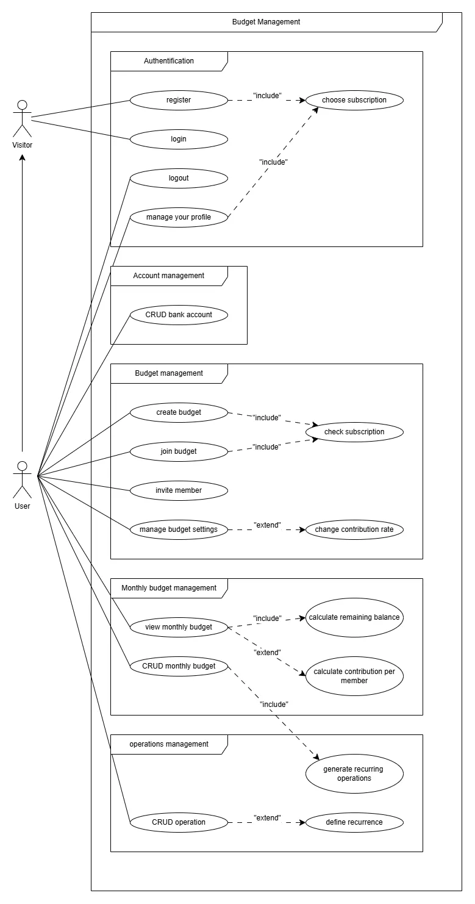
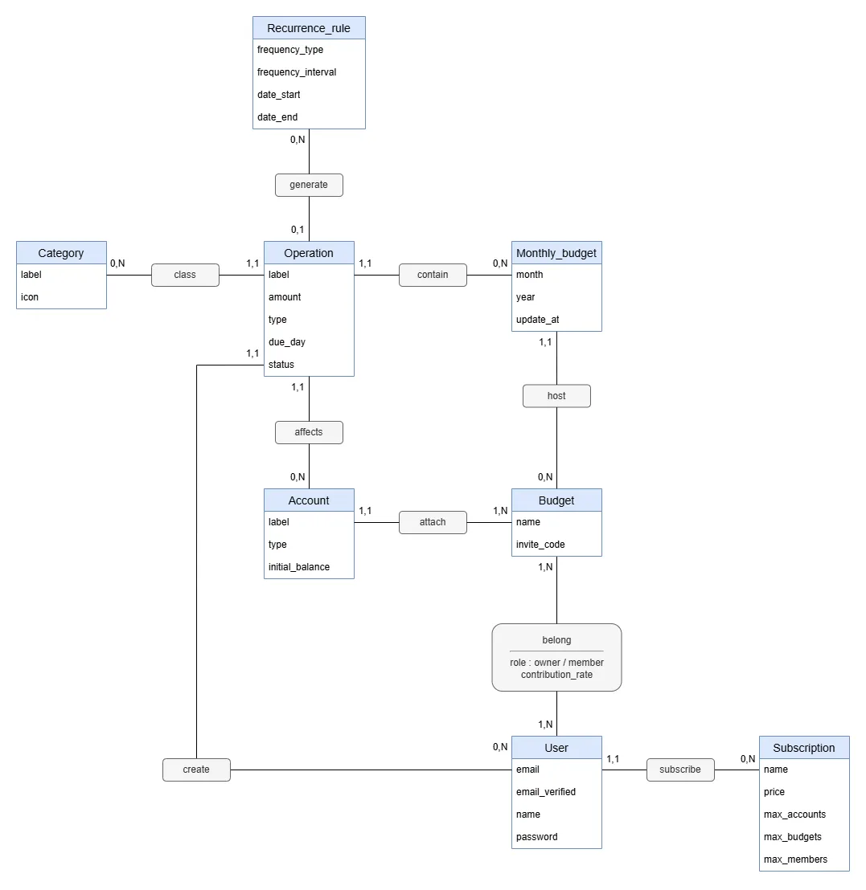
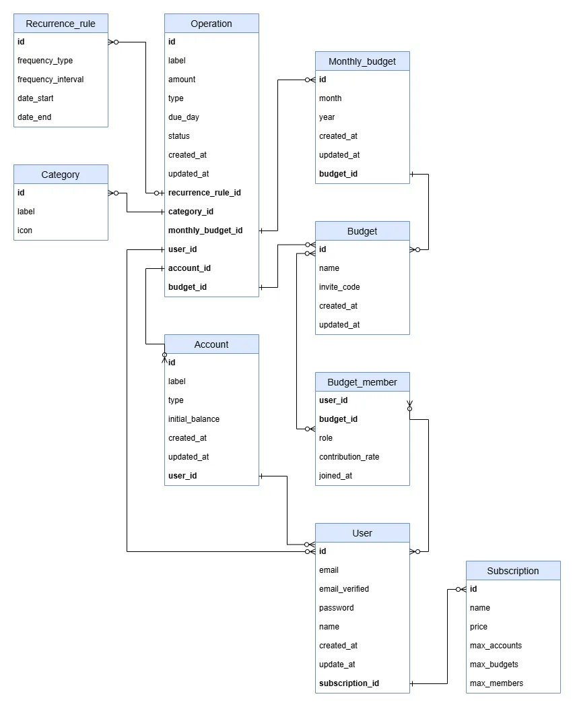
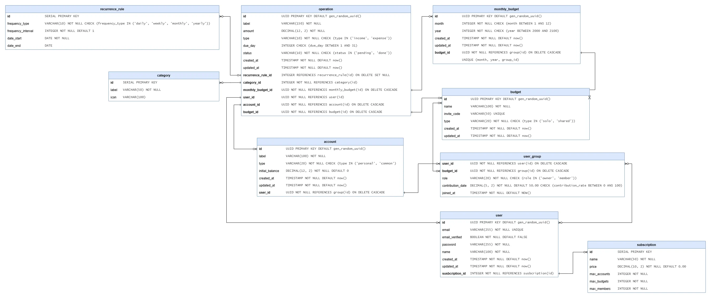

# Budget Management

> Application full-stack de gestion de budget personnel, construite avec **Next.js**, **Spring Boot** et **PostgreSQL**. Ce projet sert à la fois d'outil fonctionnel et de démonstration de compétences en architecture logicielle, containerisation et bonnes pratiques de développement.

---

## Table des matières

- [A propos](#a-propos)
- [Stack technique](#stack-technique)
- [Fonctionnalités](#fonctionnalités)
- [Architecture du projet](#architecture-du-projet)
- [Modélisation](#modélisation)
- [Installation](#installation)
- [Commandes disponibles](#commandes-disponibles)
- [Conventions](#conventions)
- [Auteur](#auteur)

---

## A propos

Budget Management est une application web permettant de gérer ses finances personnelles : comptes bancaires, budgets, opérations et suivi des dépenses.

Le projet est conçu avec une double intention :

1. **Application fonctionnelle** : Fournir un outil complet de gestion de budget avec authentification, gestion de comptes et suivi des opérations
2. **Démonstration technique** : Illustrer la maîtrise des outils modernes de développement et d'infrastructure, notamment :
   - Architecture full-stack avec API REST
   - Containerisation complète avec Docker
   - Conventions strictes (commits, code style, tests)
   - Documentation détaillée et modélisation UML

---

## Stack technique

### Frontend

| Technologie  | Version  | Usage                             |
| ------------ | -------- | --------------------------------- |
| Next.js      | `16.1.6` | Framework React (App Router, SSR) |
| React        | `19.2.3` | Bibliothèque UI                   |
| TypeScript   | `^5`     | Typage statique                   |
| Tailwind CSS | `^4`     | Styles utilitaires                |
| ESLint       | `^9`     | Linting et qualité de code        |

### Backend

| Technologie       | Version | Usage                             |
| ----------------- | ------- | --------------------------------- |
| Spring Boot       | `4.0.2` | Framework backend                 |
| Java              | `21`    | Langage principal                 |
| Maven             | `3.9.x` | Gestion de dépendances et build   |
| Spring Data JPA   | -       | Accès aux données (ORM Hibernate) |
| Spring Security   | -       | Authentification et autorisation  |
| Spring Validation | -       | Validation des données            |
| Lombok            | -       | Réduction du boilerplate Java     |

### Base de données

| Technologie | Version | Usage                         |
| ----------- | ------- | ----------------------------- |
| PostgreSQL  | `16`    | Base de données relationnelle |

### DevOps

| Technologie    | Usage                               |
| -------------- | ----------------------------------- |
| Docker         | Containerisation des services       |
| Docker Compose | Orchestration multi-containers      |
| Makefile       | Commandes de déploiement et gestion |

---

## Fonctionnalités

### Prévues

- Authentification et gestion des utilisateurs
- Gestion de comptes bancaires
- Création et suivi de budgets
- Enregistrement et catégorisation des opérations
- Gestion de groupes (budgets partagés)
- Tableau de bord avec visualisation des dépenses

### Techniques

- API REST avec conventions strictes
- Architecture en couches (Controller → Service → Repository)
- Validation des données entrantes (Jakarta Validation)
- Gestion centralisée des erreurs (GlobalExceptionHandler)
- Containerisation complète avec Docker Compose
- Commandes Makefile pour le déploiement et la maintenance

---

## Architecture du projet

```
budget-management/
├── .github/                # Templates PR et issues
├── docs/
│   ├── conventions/        # 8 guides de conventions (git, code, frontend, backend, api, bdd, tests, qualité)
│   └── diagrams/           # Diagrammes UML (use-case, MCD, MLD, MPD)
├── backend/                # Spring Boot 4, Java 21, Maven
│   └── src/
├── frontend/               # Next.js 16, React 19, TypeScript 5, Tailwind CSS 4
│   └── src/
├── .env.sample
├── .gitignore
├── CLAUDE.md
├── docker-compose.yml
├── Makefile
└── README.md
```

### Architecture backend

```
Controller → Service → Repository → Database
    ↕            ↕
   DTO        Entity
```

- **Controller** : Points d'entrée REST, aucune logique métier
- **Service** : Logique métier, transactions, conversion DTO ↔ Entity
- **Repository** : Accès aux données via Spring Data JPA
- **DTO** : Java Records avec validation Jakarta pour les échanges API
- **Entity** : Classes JPA avec Lombok pour la persistance

### Architecture frontend

- **App Router** (Next.js 16) : Routing basé sur le système de fichiers
- **Server Components** par défaut, `'use client'` uniquement si nécessaire
- **Approche hybride** : structure par features pour les modules métier, composants partagés globaux

---

## Modélisation

### Diagramme de cas d'utilisation



### Modèle Conceptuel de Données (MCD)



### Modèle Logique de Données (MLD)



### Modèle Physique de Données (MPD)



---

## Installation

### Prérequis

- **Docker** et **Docker Compose**
- **Make**
- _(Optionnel)_ Node.js >= 20 et Java 21 pour le développement local sans Docker

### Lancement rapide

```bash
# 1. Cloner le repository
git clone https://github.com/Yiroma/budget-management.git
cd budget-management

# 2. Configurer les variables d'environnement
cp .env.sample .env
# Éditer .env avec vos valeurs

# 3. Lancer l'environnement de développement
make dev
```

L'application sera accessible sur :

- **Frontend** : http://localhost:3000
- **Backend** : http://localhost:8080
- **Base de données** : localhost:5432

---

## Commandes disponibles

Toutes les commandes sont exécutées via le **Makefile** :

| Commande       | Description                                              |
| -------------- | -------------------------------------------------------- |
| `make help`    | Affiche la liste des commandes disponibles               |
| `make dev`     | Lance l'environnement de développement                   |
| `make run`     | Lance l'environnement de production (détaché)            |
| `make build`   | Build les images Docker sans lancer les containers       |
| `make stop`    | Stoppe les containers sans les supprimer                 |
| `make down`    | Stoppe et supprime les containers + networks             |
| `make restart` | Redémarre les containers                                 |
| `make test`    | Lance tous les tests (front + back)                      |
| `make lint`    | Lance le linting frontend (ESLint)                       |
| `make logs`    | Affiche les logs de tous les containers (follow)         |
| `make prune`   | Supprime containers, images, volumes et builds du projet |

---

## Conventions

Le projet suit des conventions strictes documentées dans [docs/conventions/](docs/conventions/) :

| Fichier                                               | Domaine                                                              |
| ----------------------------------------------------- | -------------------------------------------------------------------- |
| [01-git.md](docs/conventions/01-git.md)               | Branches, commits, pull requests, versioning                         |
| [02-code-style.md](docs/conventions/02-code-style.md) | Formatage, nommage, outils (Prettier, ESLint)                        |
| [03-frontend.md](docs/conventions/03-frontend.md)     | React, Next.js, TypeScript, structure des dossiers                   |
| [04-backend.md](docs/conventions/04-backend.md)       | Java, Spring Boot, architecture en couches                           |
| [05-api.md](docs/conventions/05-api.md)               | Conventions REST, status codes, format de réponse                    |
| [06-database.md](docs/conventions/06-database.md)     | Nommage, migrations, index                                           |
| [07-testing.md](docs/conventions/07-testing.md)       | Stratégie, nommage, patterns                                         |
| [08-quality.md](docs/conventions/08-quality.md)       | Accessibilité, sécurité, performance, principes SOLID/DRY/KISS/YAGNI |

### Commits

Le projet utilise les [Conventional Commits](https://www.conventionalcommits.org/) :

```
<type>(<scope>): <description>
```

Types : `feat`, `fix`, `chore`, `refactor`, `docs`, `test`, `style`, `perf`, `ci-cd`, `build`

### Branches

```
<type>-<description-courte>
```

Exemples : `feat-auth-login`, `fix-budget-calculation`, `chore-update-deps`

---

## Auteur

**Romaric Yi**

- Portfolio : [yiromaric.fr](https://yiromaric.fr)
- GitHub : [@Yiroma](https://github.com/Yiroma)
- LinkedIn : [Romaric Yi](https://linkedin.com/in/yiromaric)

---
